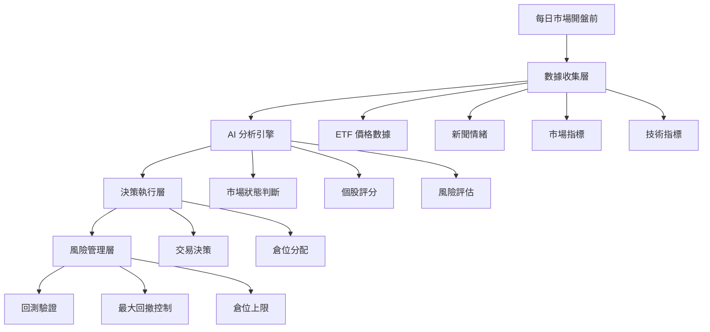

# AI Agent 量化交易系統 - 實施計劃

## 專案目標

建立一個 **AI 驅動的智能交易系統**，模擬專業交易者的決策流程：
- 每天分析市場、新聞、風險
- AI 自主決策是否交易及倉位分配
- 目標績效：月虧損 < 5%、季度盈利、年化接近 SPY

---

## 系統架構

### 核心流程



### 資料庫設計

#### 1. `market_data` - 市場數據表
```sql
CREATE TABLE market_data (
    date DATE PRIMARY KEY,
    symbol VARCHAR(10),
    open FLOAT,
    high FLOAT,
    low FLOAT,
    close FLOAT,
    volume BIGINT,
    
    -- 市場整體指標
    spy_return FLOAT,  -- SPY 當日報酬率
    vix_level FLOAT,   -- 波動率指數
    market_regime VARCHAR(20)  -- Bull/Bear/Sideways
);
```

#### 2. `news_sentiment` - 新聞情緒表
```sql
CREATE TABLE news_sentiment (
    date DATE,
    symbol VARCHAR(10),
    news_count INTEGER,
    positive_score FLOAT,  -- 0-1
    negative_score FLOAT,  -- 0-1
    sentiment_summary TEXT,  -- AI 生成的摘要
    
    PRIMARY KEY (date, symbol)
);
```

#### 3. `ai_decisions` - AI 決策記錄表
```sql
CREATE TABLE ai_decisions (
    date DATE,
    symbol VARCHAR(10),
    
    -- AI 分析結果
    market_analysis TEXT,      -- 市場分析摘要
    stock_score FLOAT,         -- 個股評分 0-100
    risk_level VARCHAR(10),    -- Low/Medium/High
    
    -- 決策
    action VARCHAR(10),        -- BUY/SELL/HOLD
    position_pct FLOAT,        -- 建議倉位百分比
    reasoning TEXT,            -- AI 推理過程
    confidence FLOAT,          -- 信心度 0-1
    
    -- 執行結果
    executed BOOLEAN,
    actual_position FLOAT,
    
    PRIMARY KEY (date, symbol)
);
```

#### 4. `portfolio_history` - 投資組合歷史
```sql
CREATE TABLE portfolio_history (
    date DATE PRIMARY KEY,
    total_value FLOAT,
    cash FLOAT,
    daily_return FLOAT,
    cumulative_return FLOAT,
    max_drawdown FLOAT,
    sharpe_ratio FLOAT,
    
    -- 持倉明細 (JSON)
    positions JSON  -- {symbol: {shares, value, pct}}
);
```

---

## 實施階段

### 📍 階段一：基礎建設 (1-2 週)

#### 任務清單
- [ ] 建立 SQLite 資料庫架構
- [ ] 開發數據收集模組
  - [ ] ETF 價格數據 (yfinance)
  - [ ] 市場指標 (SPY, VIX)
  - [ ] 新聞 API 整合 (NewsAPI)
- [ ] 建立 Colab Notebook 環境
- [ ] 測試數據收集流程

#### 技術棧
- **資料庫**: SQLite (易於 Colab 使用)
- **數據源**: yfinance, Alpha Vantage, NewsAPI
- **開發環境**: Google Colab

#### 產出
- `data_collector.py` - 數據收集腳本
- `database_schema.sql` - 資料庫結構
- `etf_database.db` - 初始化資料庫

---

### 📍 階段二：AI 決策引擎 (2-3 週)

#### 核心功能

**1. 市場狀態判斷 (Market Regime Detection)**
```python
def analyze_market_state(date):
    """
    AI 分析當前市場狀態
    輸入：當日市場數據
    輸出：Bull/Bear/Sideways + 信心度
    """
    prompt = f"""
    分析以下市場數據，判斷當前市場狀態：
    
    - SPY 近 5 日報酬: {spy_returns}
    - VIX 水平: {vix}
    - 成交量變化: {volume_change}
    
    請回答：
    1. 市場狀態 (多頭/空頭/震盪)
    2. 信心度 (0-1)
    3. 主要理由 (30 字內)
    """
    
    # 使用 Gemini API 或 Ollama
    return ai_model.generate(prompt)
```

**2. 個股評分系統**
```python
def score_etf(symbol, date):
    """
    對單一 ETF 進行評分
    輸入：股票代碼、日期
    輸出：評分 (0-100)、建議動作
    """
    # 收集多維度數據
    price_data = get_price_data(symbol, days=30)
    news_sentiment = get_news_sentiment(symbol, date)
    technical_indicators = calculate_indicators(price_data)
    
    prompt = f"""
    評估 {symbol} 的投資價值：
    
    技術面：
    - 趨勢: {technical_indicators['trend']}
    - RSI: {technical_indicators['rsi']}
    - MACD: {technical_indicators['macd']}
    
    基本面/消息面：
    - 新聞數量: {news_sentiment['count']}
    - 正面情緒: {news_sentiment['positive']}%
    - 負面情緒: {news_sentiment['negative']}%
    
    請給出：
    1. 綜合評分 (0-100)
    2. 建議動作 (買入/賣出/持有)
    3. 建議倉位百分比
    4. 推理過程
    """
    
    return ai_model.generate(prompt)
```

**3. 風險評估**
```python
def assess_risk(portfolio, market_state):
    """
    評估當前風險水平
    """
    prompt = f"""
    評估投資組合風險：
    
    市場狀態: {market_state}
    當前倉位: {portfolio.positions}
    近 30 日最大回撤: {portfolio.max_drawdown}
    
    請評估：
    1. 風險等級 (低/中/高)
    2. 是否需要減倉
    3. 風險控制建議
    """
    
    return ai_model.generate(prompt)
```

#### 任務清單
- [ ] 開發 AI 提示詞模板
- [ ] 整合 Gemini 1.5 Flash API
- [ ] 建立決策邏輯流程
- [ ] 測試 AI 回應穩定性

---

### 📍 階段三：回測框架 (2 週)

#### 回測引擎設計

```python
class AITradingBacktest:
    def __init__(self, start_date, end_date, initial_capital=100000):
        self.start_date = start_date
        self.end_date = end_date
        self.capital = initial_capital
        self.portfolio = Portfolio()
        
    def run(self):
        """執行回測"""
        for date in self.trading_dates:
            # 1. 收集當日數據
            market_data = self.get_market_data(date)
            
            # 2. AI 分析市場
            market_state = self.ai_analyze_market(market_data)
            
            # 3. AI 評估每個 ETF
            decisions = {}
            for symbol in self.universe:
                score = self.ai_score_etf(symbol, date)
                decisions[symbol] = score
            
            # 4. 風險控制
            risk_check = self.assess_risk(self.portfolio, market_state)
            if risk_check['level'] == 'HIGH':
                # 啟動防守模式
                self.reduce_positions()
            
            # 5. 執行交易
            self.execute_trades(decisions, date)
            
            # 6. 記錄結果
            self.record_portfolio(date)
            
        # 生成績效報告
        return self.generate_report()
```

#### 任務清單
- [ ] 開發回測引擎
- [ ] 實現倉位管理邏輯
- [ ] 加入風險控制機制
- [ ] 產出績效報告模組

---

### 📍 階段四：優化與標準化 (2-3 週)

#### 1. 策略優化
- 測試不同 AI 提示詞版本
- 調整風險參數
- 優化倉位分配演算法

#### 2. 績效監控
建立儀表板追蹤：
- 月度報酬率
- 最大回撤
- 勝率
- Sharpe Ratio
- AI 決策準確度

#### 3. 教育材料準備
- 系統操作手冊
- AI 決策邏輯解析
- 回測報告範例
- 風險管理指南

---

## 技術選擇建議

### AI 模型選擇

| 方案 | 優點 | 缺點 | 成本 |
|------|------|------|------|
| **Gemini 1.5 Flash** | 便宜、快速、API 穩定 | 需要網路 | $0.075/1M tokens |
| **Ollama (本地)** | 免費、隱私 | 較慢、需要 GPU | 免費 |
| **Claude 3.5 Sonnet** | 推理能力強 | 較貴 | $3/1M tokens |

> **推薦**：先用 Gemini 1.5 Flash 開發，成本低且效能好

### 數據源

| 數據類型 | 推薦來源 | 成本 |
|---------|---------|------|
| ETF 價格 | yfinance | 免費 |
| 新聞 | NewsAPI | 免費額度 100 次/日 |
| 市場情緒 | FinBrain, Reddit API | 部分免費 |
| 基本面 | Alpha Vantage | 免費額度 25 次/日 |

---

## 風險管理規則

### 硬性規則（不可違反）
1. **單月最大虧損 5%** → 觸發停止交易
2. **單日最大虧損 2%** → 當日不再開新倉
3. **單一 ETF 最大倉位 20%** → 分散風險
4. **現金保留底線 10%** → 保持流動性

### AI 建議（可調整）
- 動態調整倉位比例
- 市場恐慌時減倉
- 高波動時降低槓桿

---

## 預期績效目標

### 保守估計（可實現）
- **年化報酬**: 8-12%
- **Sharpe Ratio**: 0.8-1.2
- **最大回撤**: < 15%
- **月度勝率**: 60-70%

### 與您的目標對比
| 指標 | 您的期望 | 系統預期 | 評估 |
|------|---------|----------|------|
| 月虧損 | < 5% | ✅ 可達成 | 透過風控 |
| 季度盈利 | 100% | ⚠️ 70-80% | 需要容忍偶爾虧損季度 |
| 年化報酬 | ≈ SPY (10-12%) | ✅ 可達成 | 需要一年以上數據驗證 |

---

## 成本估算

### 數據成本（月）
- NewsAPI Pro: $0-49/月
- Alpha Vantage: $0-50/月

### AI API 成本（月）
- Gemini 1.5 Flash: 估計 $5-20/月
  - 每天 20 次決策 × 30 天 = 600 次
  - 每次約 1000 tokens
  - 總計: 600K tokens ≈ $0.045

### 總成本：$10-100/月（可控）

---

## 下一步行動

### 立即可做
1. ✅ 討論並確認系統架構
2. ✅ 選擇要交易的 ETF 清單（建議 10-20 個）
3. ✅ 決定 AI 模型（Gemini vs Ollama）

### 本週任務
1. 建立資料庫架構
2. 開發數據收集模組
3. 測試 Gemini API 決策流程

### 本月目標
1. 完成階段一、二
2. 執行首次回測
3. 驗證系統可行性

---

## 參考資源

### 學術研究
- "Deep Reinforcement Learning for Trading" (2020)
- "Sentiment Analysis for Stock Price Prediction" (2021)
- "LLM-based Trading Agents" (2024)

### 開源專案
- FinRL (金融強化學習)
- Backtrader (回測框架)
- Alpaca Trading API (實盤交易)

### 業界案例
- Two Sigma: 使用 ML 做因子選股
- AQR: 結合傳統量化 + AI
- Renaissance: 純數據驅動策略

---

## 風險聲明

> ⚠️ **重要提醒**
> 
> 1. AI 交易系統不保證盈利
> 2. 過去績效不代表未來表現
> 3. 建議先用小資金測試
> 4. 定期監控 AI 決策合理性
> 5. 保持人工監督，AI 僅為輔助工具
