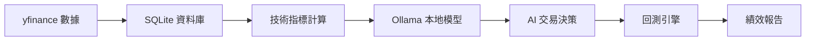

# Colab 免費版 AI 交易系統 MVP 計劃

## 目標
在 Google Colab 免費環境下，使用 Ollama 本地模型建立 AI 交易決策系統的概念驗證版本。

---

## 系統架構（簡化版）

---

## Colab 環境配置
### 硬體限制
- **免費版 GPU**：T4 (16GB VRAM)
- **運行時間**：最長 12 小時
- **RAM**：12‑13 GB
- **磁碟**：78 GB

### 模型選擇策略
> ✅ **推薦**：先用 `gemma3:4b` 開發，確認流程無誤後再換 `deepseek-r1:7b`

## 📋 格式示範 4：使用箭頭 + 對比
### 模型選擇策略
```
階段 1：開發測試
   → 推薦模型：gemma3:4b
   → 顯存需求：~4GB
   → 速度：快 ⚡
   → 推理能力：中等 ⭐⭐⭐

階段 2：正式回測
   → 推薦模型：deepseek-r1:7b
   → 顯存需求：~7GB
   → 速度：中等 ⚡⚡
   → 推理能力：強 ⭐⭐⭐⭐

階段 3：深度分析
   → 推薦模型：qwen3:14b
   → 顯存需求：~14GB
   → 速度：慢 ⚡⚡⚡
   → 推理能力：很強 ⭐⭐⭐⭐⭐
```
---
## 📋 格式示範 2：使用 Emoji + 引用區塊
### Colab 免費版 vs 付費版比較
> 🆓 **免費版**
> ├─ 使用 14B+ 模型：❌ 不支援
> ├─ 連續運行 24 小時：❌ 不支援
> ├─ 高速 GPU (V100/A100)：❌ 不支援
> └─ 處理 10 年以上數據：⚠️ 速度慢
>
> > 💎 **Colab Pro ($9.99/月)**
> > ├─ 使用 14B+ 模型：✅ 支援
> > ├─ 連續運行 24 小時：✅ 支援
> > ├─ 高速 GPU (V100/A100)：✅ 支援
> > └─ 處理 10 年以上數據：✅ 速度快
---
## 資料庫設計（精簡版）
### `daily_data` 表（每日市場數據）
- `date` (DATE, PK)
- `symbol` (VARCHAR(10))
- 價格欄位：`open`, `high`, `low`, `close`, `volume`
- 技術指標：`sma_20`, `sma_50`, `sma_200`, `rsi_14`, `macd`, `macd_signal`
- 市場環境：`spy_return`, `vix`, `market_regime`

### `ai_analysis` 表（AI 分析結果）
- `date`, `symbol`
- 市場看法：`market_view`
- 技術分數：`technical_score` (0‑100)
- 風險等級：`risk_level`
- 決策：`action` (BUY/SELL/HOLD), `position_size` (0‑1), `confidence`
- 推理過程：`reasoning`
- 元數據：`model_used`, `tokens_used`, `processing_time`

### `backtest_trades` 表（回測交易記錄）
- `trade_id` (PK, AUTOINCREMENT)
- `date`, `symbol`, `action` (BUY/SELL)
- `shares`, `price`, `position_value`
- `portfolio_value`, `cash`

### `performance_metrics` 表（績效指標）
- `date` (PK)
- `total_value`, `daily_return`, `cumulative_return`
- `max_drawdown`, `sharpe_ratio`, `win_rate`
---
## 分階段實施計劃
### 🔵 Phase 1：基礎環境搭建（1 天）
#### Notebook 1：`01_setup_environment.ipynb`
```python
# ==== 安裝 Ollama ====
!curl -fsSL https://ollama.com/install.sh | sh

# 啟動 Ollama 服務
import subprocess, time
proc = subprocess.Popen(['ollama', 'serve'], stdout=subprocess.PIPE, stderr=subprocess.PIPE)
time.sleep(5)

# 下載模型
!ollama pull gemma3:4b

# ==== 安裝 Python 套件 ====
!pip install yfinance pandas numpy sqlite3 ta-lib requests

# ==== 建立資料庫 ====
import sqlite3
conn = sqlite3.connect('/content/trading_system.db')
cursor = conn.cursor()
# 建表（簡化版）
cursor.execute('''
CREATE TABLE IF NOT EXISTS daily_data (
    date DATE PRIMARY KEY,
    symbol VARCHAR(10),
    open REAL, high REAL, low REAL, close REAL, volume INTEGER,
    sma_20 REAL, sma_50 REAL, sma_200 REAL,
    rsi_14 REAL, macd REAL, macd_signal REAL,
    spy_return REAL, vix REAL, market_regime TEXT
)''')
conn.commit()
print('✅ 環境配置完成！')
```
---
### 🟢 Phase 2：數據收集與處理（2 天）
#### Notebook 2：`02_data_collection.ipynb`
```python
import yfinance as yf, pandas as pd
from datetime import datetime, timedelta

SYMBOLS = ['SPY', 'QQQ', 'IWM', 'DIA', 'VTI']
START_DATE = '2020-01-01'
END_DATE = '2024-12-31'

def download_data(symbol, start, end):
    data = yf.download(symbol, start=start, end=end)
    data['Symbol'] = symbol
    return data

all_data = {sym: download_data(sym, START_DATE, END_DATE) for sym in SYMBOLS}

# 計算技術指標（簡化版）
def calculate_indicators(df):
    df['SMA_20'] = df['Close'].rolling(20).mean()
    df['SMA_50'] = df['Close'].rolling(50).mean()
    df['SMA_200'] = df['Close'].rolling(200).mean()
    delta = df['Close'].diff()
    gain = (delta.where(delta > 0, 0)).rolling(14).mean()
    loss = (-delta.where(delta < 0, 0)).rolling(14).mean()
    rs = gain / loss
    df['RSI_14'] = 100 - (100 / (1 + rs))
    exp1 = df['Close'].ewm(span=12, adjust=False).mean()
    exp2 = df['Close'].ewm(span=26, adjust=False).mean()
    df['MACD'] = exp1 - exp2
    df['MACD_Signal'] = df['MACD'].ewm(span=9, adjust=False).mean()
    return df

for sym in SYMBOLS:
    all_data[sym] = calculate_indicators(all_data[sym])

# 市場狀態判斷（以 SPY 為基準）
spy = all_data['SPY']

def determine_market_regime(row):
    if pd.isna(row['SMA_50']) or pd.isna(row['SMA_200']):
        return 'Unknown'
    if row['SMA_50'] > row['SMA_200']:
        return 'Bull'
    if row['SMA_50'] < row['SMA_200']:
        return 'Bear'
    return 'Sideways'

spy['Market_Regime'] = spy.apply(determine_market_regime, axis=1)

# 合併 VIX 資料
vix = yf.download('^VIX', start=START_DATE, end=END_DATE)

import sqlite3
conn = sqlite3.connect('/content/trading_system.db')
for sym, df in all_data.items():
    df['Date'] = df.index
    df['Symbol'] = sym
    df = df.merge(spy[['Market_Regime']], left_on='Date', right_index=True, how='left')
    df = df.merge(vix[['Close']].rename(columns={'Close': 'VIX'}), left_on='Date', right_index=True, how='left')
    df['SPY_Return'] = spy['Close'].pct_change()
    df.to_sql('daily_data', conn, if_exists='append', index=False)
print('✅ 數據收集完成！')
```
---
### 🟡 Phase 3：AI 決策引擎（3‑4 天）
#### Notebook 3：`03_ai_decision_engine.ipynb`
```python
import requests, json, sqlite3, pandas as pd, time

def query_ollama(prompt, model='gemma3:4b'):
    url = 'http://localhost:11434/api/generate'
    payload = {
        'model': model,
        'prompt': prompt,
        'stream': False,
        'options': {'temperature': 0.3, 'num_ctx': 4096}
    }
    resp = requests.post(url, json=payload)
    data = resp.json()
    return data['response'], data.get('eval_count', 0)

# 市場分析範例
def analyze_market(date, market_data):
    prompt = f"你是一個專業量化分析師。請根據以下資料分析市場狀態：\n日期: {date}\nSPY 收盤: ${market_data['spy_close']:.2f}\nSMA_50: ${market_data['sma_50']:.2f}\nSMA_200: ${market_data['sma_200']:.2f}\nRSI: {market_data['rsi']:.1f}\nVIX: {market_data['vix']:.1f}\n市場趨勢: {market_data['regime']}\n\n請簡短回答（每項不超過 15 字）：\n1. 市場狀態？\n2. 風險等級？\n3. 建議倉位？"
    resp, tokens = query_ollama(prompt)
    return {'market_view': resp, 'tokens_used': tokens}
```
---
### 🔴 Phase 4：回測引擎（2‑3 天）
#### Notebook 4：`04_backtesting_engine.ipynb`
```python
import sqlite3, pandas as pd, numpy as np, time
from tqdm import tqdm

class SimpleBacktester:
    def __init__(self, initial_capital=100000):
        self.initial_capital = initial_capital
        self.cash = initial_capital
        self.positions = {}
        self.portfolio_history = []

    def get_ai_decision(self, date, symbol):
        conn = sqlite3.connect('/content/trading_system.db')
        df = pd.read_sql(f"SELECT * FROM ai_analysis WHERE date='{date}' AND symbol='{symbol}'", conn)
        conn.close()
        return df.iloc[0] if not df.empty else None

    def get_price(self, date, symbol):
        conn = sqlite3.connect('/content/trading_system.db')
        df = pd.read_sql(f"SELECT close FROM daily_data WHERE date='{date}' AND symbol='{symbol}'", conn)
        conn.close()
        return df['close'].iloc[0] if not df.empty else None

    def execute_trade(self, date, symbol, action, position_pct):
        price = self.get_price(date, symbol)
        if price is None:
            return
        if action == 'BUY':
            target = self.cash * position_pct
            shares = int(target / price)
            if shares > 0:
                self.cash -= shares * price
                self.positions[symbol] = self.positions.get(symbol, 0) + shares
        elif action == 'SELL':
            shares = self.positions.get(symbol, 0)
            if shares > 0:
                self.cash += shares * price
                self.positions[symbol] = 0

    def get_portfolio_value(self, date):
        total = self.cash
        for sym, shares in self.positions.items():
            if shares > 0:
                price = self.get_price(date, sym)
                if price:
                    total += shares * price
        return total

    def run(self, start_date, end_date, symbols):
        conn = sqlite3.connect('/content/trading_system.db')
        days = pd.read_sql(f"SELECT DISTINCT date FROM daily_data WHERE date BETWEEN '{start_date}' AND '{end_date}' ORDER BY date", conn)['date']
        conn.close()
        for date in tqdm(days):
            for sym in symbols:
                decision = self.get_ai_decision(date, sym)
                if decision is not None:
                    self.execute_trade(date, sym, decision['action'], decision['position_size'])
            self.portfolio_history.append({'date': date, 'value': self.get_portfolio_value(date)})
        self.calculate_performance()
        print('✅ 回測完成！')

    def calculate_performance(self):
        df = pd.DataFrame(self.portfolio_history)
        df['return'] = df['value'].pct_change()
        df['cum_return'] = (1 + df['return']).cumprod() - 1
        df['peak'] = df['value'].cummax()
        df['drawdown'] = (df['value'] - df['peak']) / df['peak']
        max_dd = df['drawdown'].min()
        sharpe = df['return'].mean() / df['return'].std() * np.sqrt(252)
        conn = sqlite3.connect('/content/trading_system.db')
        df.to_sql('performance_metrics', conn, if_exists='replace', index=False)
        conn.close()
        print(f"最大回撤: {max_dd*100:.2f}%")
        print(f"Sharpe Ratio: {sharpe:.2f}")
```
---
## 時間估算與成本
### 開發時間表
- **Phase 1**：環境搭建 – 1 天
- **Phase 2**：數據收集 – 2 天
- **Phase 3**：AI 決策引擎 – 3‑4 天
- **Phase 4**：回測引擎 – 2‑3 天
- **總計**：8‑10 天

### Colab 免費版限制
- ✅ 可行：輕量模型（4B‑7B）
- ⚠️ 注意：12 小時運行限制
- 💡 建議：分段處理，定期將資料庫備份至 Google Drive
---
## 下一步行動
1. ✅ 完成環境搭建 Notebook（`01_setup_environment.ipynb`）
2. ✅ 測試 Ollama + Gemma3 4B 在 Colab 上的運行
3. ✅ 下載 SPY 歷史數據並建立資料庫
4. ✅ 執行第一次 AI 決策測試

如果您需要進一步調整或加入其他說明，隨時告訴我！

## 目標
在 Google Colab 免費環境下，使用 Ollama 本地模型建立 AI 交易決策系統的概念驗證版本。

---

## 系統架構（簡化版）

---

## Colab 環境配置
### 硬體限制
- **免費版 GPU**：T4 (16GB VRAM)
- **運行時間**：最長 12 小時
- **RAM**：12‑13 GB
- **磁碟**：78 GB

### 模型選擇策略
> ✅ **推薦**：先用 `gemma3:4b` 開發，確認流程無誤後再換 `deepseek-r1:7b`

## 📋 格式示範 4：使用箭頭 + 對比
### 模型選擇策略
```
階段 1：開發測試
   → 推薦模型：gemma3:4b
   → 顯存需求：~4GB
   → 速度：快 ⚡
   → 推理能力：中等 ⭐⭐⭐

階段 2：正式回測
   → 推薦模型：deepseek-r1:7b
   → 顯存需求：~7GB
   → 速度：中等 ⚡⚡
   → 推理能力：強 ⭐⭐⭐⭐

階段 3：深度分析
   → 推薦模型：qwen3:14b
   → 顯存需求：~14GB
   → 速度：慢 ⚡⚡⚡
   → 推理能力：很強 ⭐⭐⭐⭐⭐
```
---
## 📋 格式示範 2：使用 Emoji + 引用區塊
### Colab 免費版 vs 付費版比較
> 🆓 **免費版**
> ├─ 使用 14B+ 模型：❌ 不支援
> ├─ 連續運行 24 小時：❌ 不支援
> ├─ 高速 GPU (V100/A100)：❌ 不支援
> └─ 處理 10 年以上數據：⚠️ 速度慢
>
> > 💎 **Colab Pro ($9.99/月)**
> > ├─ 使用 14B+ 模型：✅ 支援
> > ├─ 連續運行 24 小時：✅ 支援
> > ├─ 高速 GPU (V100/A100)：✅ 支援
> > └─ 處理 10 年以上數據：✅ 速度快
---
## 資料庫設計（精簡版）
### `daily_data` 表（每日市場數據）
- `date` (DATE, PK)
- `symbol` (VARCHAR(10))
- 價格欄位：`open`, `high`, `low`, `close`, `volume`
- 技術指標：`sma_20`, `sma_50`, `sma_200`, `rsi_14`, `macd`, `macd_signal`
- 市場環境：`spy_return`, `vix`, `market_regime`

### `ai_analysis` 表（AI 分析結果）
- `date`, `symbol`
- 市場看法：`market_view`
- 技術分數：`technical_score` (0‑100)
- 風險等級：`risk_level`
- 決策：`action` (BUY/SELL/HOLD), `position_size` (0‑1), `confidence`
- 推理過程：`reasoning`
- 元數據：`model_used`, `tokens_used`, `processing_time`

### `backtest_trades` 表（回測交易記錄）
- `trade_id` (PK, AUTOINCREMENT)
- `date`, `symbol`, `action` (BUY/SELL)
- `shares`, `price`, `position_value`
- `portfolio_value`, `cash`

### `performance_metrics` 表（績效指標）
- `date` (PK)
- `total_value`, `daily_return`, `cumulative_return`
- `max_drawdown`, `sharpe_ratio`, `win_rate`
---
## 分階段實施計劃
### 🔵 Phase 1：基礎環境搭建（1 天）
#### Notebook 1：`01_setup_environment.ipynb`
```python
# ==== 安裝 Ollama ====
!curl -fsSL https://ollama.com/install.sh | sh

# 啟動 Ollama 服務
import subprocess, time
proc = subprocess.Popen(['ollama', 'serve'], stdout=subprocess.PIPE, stderr=subprocess.PIPE)
time.sleep(5)

# 下載模型
!ollama pull gemma3:4b

# ==== 安裝 Python 套件 ====
!pip install yfinance pandas numpy sqlite3 ta-lib requests

# ==== 建立資料庫 ====
import sqlite3
conn = sqlite3.connect('/content/trading_system.db')
cursor = conn.cursor()
# 建表（簡化版）
cursor.execute('''
CREATE TABLE IF NOT EXISTS daily_data (
    date DATE PRIMARY KEY,
    symbol VARCHAR(10),
    open REAL, high REAL, low REAL, close REAL, volume INTEGER,
    sma_20 REAL, sma_50 REAL, sma_200 REAL,
    rsi_14 REAL, macd REAL, macd_signal REAL,
    spy_return REAL, vix REAL, market_regime TEXT
)''')
conn.commit()
print('✅ 環境配置完成！')
```
---
### 🟢 Phase 2：數據收集與處理（2 天）
#### Notebook 2：`02_data_collection.ipynb`
```python
import yfinance as yf, pandas as pd
from datetime import datetime, timedelta

SYMBOLS = ['SPY', 'QQQ', 'IWM', 'DIA', 'VTI']
START_DATE = '2020-01-01'
END_DATE = '2024-12-31'

def download_data(symbol, start, end):
    data = yf.download(symbol, start=start, end=end)
    data['Symbol'] = symbol
    return data

all_data = {sym: download_data(sym, START_DATE, END_DATE) for sym in SYMBOLS}

# 計算技術指標（簡化版）
def calculate_indicators(df):
    df['SMA_20'] = df['Close'].rolling(20).mean()
    df['SMA_50'] = df['Close'].rolling(50).mean()
    df['SMA_200'] = df['Close'].rolling(200).mean()
    delta = df['Close'].diff()
    gain = (delta.where(delta > 0, 0)).rolling(14).mean()
    loss = (-delta.where(delta < 0, 0)).rolling(14).mean()
    rs = gain / loss
    df['RSI_14'] = 100 - (100 / (1 + rs))
    exp1 = df['Close'].ewm(span=12, adjust=False).mean()
    exp2 = df['Close'].ewm(span=26, adjust=False).mean()
    df['MACD'] = exp1 - exp2
    df['MACD_Signal'] = df['MACD'].ewm(span=9, adjust=False).mean()
    return df

for sym in SYMBOLS:
    all_data[sym] = calculate_indicators(all_data[sym])

# 市場狀態判斷（以 SPY 為基準）
spy = all_data['SPY']

def determine_market_regime(row):
    if pd.isna(row['SMA_50']) or pd.isna(row['SMA_200']):
        return 'Unknown'
    if row['SMA_50'] > row['SMA_200']:
        return 'Bull'
    if row['SMA_50'] < row['SMA_200']:
        return 'Bear'
    return 'Sideways'

spy['Market_Regime'] = spy.apply(determine_market_regime, axis=1)

# 合併 VIX 資料
vix = yf.download('^VIX', start=START_DATE, end=END_DATE)

import sqlite3
conn = sqlite3.connect('/content/trading_system.db')
for sym, df in all_data.items():
    df['Date'] = df.index
    df['Symbol'] = sym
    df = df.merge(spy[['Market_Regime']], left_on='Date', right_index=True, how='left')
    df = df.merge(vix[['Close']].rename(columns={'Close': 'VIX'}), left_on='Date', right_index=True, how='left')
    df['SPY_Return'] = spy['Close'].pct_change()
    df.to_sql('daily_data', conn, if_exists='append', index=False)
print('✅ 數據收集完成！')
```
---
### 🟡 Phase 3：AI 決策引擎（3‑4 天）
#### Notebook 3：`03_ai_decision_engine.ipynb`
```python
import requests, json, sqlite3, pandas as pd, time

def query_ollama(prompt, model='gemma3:4b'):
    url = 'http://localhost:11434/api/generate'
    payload = {
        'model': model,
        'prompt': prompt,
        'stream': False,
        'options': {'temperature': 0.3, 'num_ctx': 4096}
    }
    resp = requests.post(url, json=payload)
    data = resp.json()
    return data['response'], data.get('eval_count', 0)

# 市場分析範例
def analyze_market(date, market_data):
    prompt = f"你是一個專業量化分析師。請根據以下資料分析市場狀態：\n日期: {date}\nSPY 收盤: ${market_data['spy_close']:.2f}\nSMA_50: ${market_data['sma_50']:.2f}\nSMA_200: ${market_data['sma_200']:.2f}\nRSI: {market_data['rsi']:.1f}\nVIX: {market_data['vix']:.1f}\n市場趨勢: {market_data['regime']}\n\n請簡短回答（每項不超過 15 字）：\n1. 市場狀態？\n2. 風險等級？\n3. 建議倉位？"
    resp, tokens = query_ollama(prompt)
    return {'market_view': resp, 'tokens_used': tokens}
```
---
### 🔴 Phase 4：回測引擎（2‑3 天）
#### Notebook 4：`04_backtesting_engine.ipynb`
```python
import sqlite3, pandas as pd, numpy as np, time
from tqdm import tqdm

class SimpleBacktester:
    def __init__(self, initial_capital=100000):
        self.initial_capital = initial_capital
        self.cash = initial_capital
        self.positions = {}
        self.portfolio_history = []

    def get_ai_decision(self, date, symbol):
        conn = sqlite3.connect('/content/trading_system.db')
        df = pd.read_sql(f"SELECT * FROM ai_analysis WHERE date='{date}' AND symbol='{symbol}'", conn)
        conn.close()
        return df.iloc[0] if not df.empty else None

    def get_price(self, date, symbol):
        conn = sqlite3.connect('/content/trading_system.db')
        df = pd.read_sql(f"SELECT close FROM daily_data WHERE date='{date}' AND symbol='{symbol}'", conn)
        conn.close()
        return df['close'].iloc[0] if not df.empty else None

    def execute_trade(self, date, symbol, action, position_pct):
        price = self.get_price(date, symbol)
        if price is None:
            return
        if action == 'BUY':
            target = self.cash * position_pct
            shares = int(target / price)
            if shares > 0:
                self.cash -= shares * price
                self.positions[symbol] = self.positions.get(symbol, 0) + shares
        elif action == 'SELL':
            shares = self.positions.get(symbol, 0)
            if shares > 0:
                self.cash += shares * price
                self.positions[symbol] = 0

    def get_portfolio_value(self, date):
        total = self.cash
        for sym, shares in self.positions.items():
            if shares > 0:
                price = self.get_price(date, sym)
                if price:
                    total += shares * price
        return total

    def run(self, start_date, end_date, symbols):
        conn = sqlite3.connect('/content/trading_system.db')
        days = pd.read_sql(f"SELECT DISTINCT date FROM daily_data WHERE date BETWEEN '{start_date}' AND '{end_date}' ORDER BY date", conn)['date']
        conn.close()
        for date in tqdm(days):
            for sym in symbols:
                decision = self.get_ai_decision(date, sym)
                if decision is not None:
                    # 假設 decision 包含 action 與 position_size（0‑1）
                    self.execute_trade(date, sym, decision['action'], decision['position_size'])
            self.portfolio_history.append({'date': date, 'value': self.get_portfolio_value(date)})
        self.calculate_performance()
        print('✅ 回測完成！')

    def calculate_performance(self):
        df = pd.DataFrame(self.portfolio_history)
        df['return'] = df['value'].pct_change()
        df['cum_return'] = (1 + df['return']).cumprod() - 1
        df['peak'] = df['value'].cummax()
        df['drawdown'] = (df['value'] - df['peak']) / df['peak']
        max_dd = df['drawdown'].min()
        sharpe = df['return'].mean() / df['return'].std() * np.sqrt(252)
        conn = sqlite3.connect('/content/trading_system.db')
        df.to_sql('performance_metrics', conn, if_exists='replace', index=False)
        conn.close()
        print(f"最大回撤: {max_dd*100:.2f}%")
        print(f"Sharpe Ratio: {sharpe:.2f}")
```
---
## 時間估算與成本
### 開發時間表
- **Phase 1**：環境搭建 – 1 天
- **Phase 2**：數據收集 – 2 天
- **Phase 3**：AI 決策引擎 – 3‑4 天
- **Phase 4**：回測引擎 – 2‑3 天
- **總計**：8‑10 天

### Colab 免費版限制
- ✅ 可行：輕量模型（4B‑7B）
- ⚠️ 注意：12 小時運行限制
- 💡 建議：分段處理，定期將資料庫備份至 Google Drive
---
## 下一步行動
1. ✅ 完成環境搭建 Notebook（`01_setup_environment.ipynb`）
2. ✅ 測試 Ollama + Gemma3 4B 在 Colab 上的運行
3. ✅ 下載 SPY 歷史數據並建立資料庫
4. ✅ 執行第一次 AI 決策測試

如果您需要我直接在此文件中加入其他說明或調整格式，請告訴我！

## 目標
在 Google Colab 免費環境下，使用 Ollama 本地模型建立 AI 交易決策系統的概念驗證版本。

---

## 系統架構（簡化版）


---

## Colab 環境配置

### 硬體限制
- **免費版 GPU**: T4 (16GB VRAM)
- **運行時間**: 最長 12 小時
- **RAM**: 12-13 GB
- **磁碟**: 78 GB

### 模型選擇策略

| 階段 | 推薦模型 | 顯存需求 | 速度 | 推理能力 |
|------|---------|----------|------|----------|
| 開發測試 | `gemma3:4b` | ~4GB | 快 | 中等 |
| 正式回測 | `deepseek-r1:7b` | ~7GB | 中等 | 強 |
| 深度分析 | `qwen3:14b` | ~14GB | 慢 | 很強 |

> ✅ **推薦**：先用 `gemma3:4b` 開發，確認流程無誤後再換 `deepseek-r1:7b`

## 📋 格式示範 4：使用箭頭 + 對比
### 模型選擇策略
```
階段 1：開發測試
   → 推薦模型：gemma3:4b
   → 顯存需求：~4GB
   → 速度：快 ⚡
   → 推理能力：中等 ⭐⭐⭐

階段 2：正式回測
   → 推薦模型：deepseek-r1:7b
   → 顯存需求：~7GB
   → 速度：中等 ⚡⚡
   → 推理能力：強 ⭐⭐⭐⭐

階段 3：深度分析
   → 推薦模型：qwen3:14b
   → 顯存需求：~14GB
   → 速度：慢 ⚡⚡⚡
   → 推理能力：很強 ⭐⭐⭐⭐⭐
```

---

## 📋 格式示範 2：使用 Emoji + 引用區塊
### Colab 免費版 vs 付費版比較
> 🆓 **免費版**
> ├─ 使用 14B+ 模型：❌ 不支援
> ├─ 連續運行 24 小時：❌ 不支援
> ├─ 高速 GPU (V100/A100)：❌ 不支援
> └─ 處理 10 年以上數據：⚠️ 速度慢
>
> > 💎 **Colab Pro ($9.99/月)**
> > ├─ 使用 14B+ 模型：✅ 支援
> > ├─ 連續運行 24 小時：✅ 支援
> > ├─ 高速 GPU (V100/A100)：✅ 支援
> > └─ 處理 10 年以上數據：✅ 速度快

---

## 資料庫設計（精簡版）

### 表 1: `daily_data` - 每日市場數據

```sql
CREATE TABLE daily_data (
    date DATE PRIMARY KEY,
    symbol VARCHAR(10),
    
    -- 價格數據
    open REAL,
    high REAL,
    low REAL,
    close REAL,
    volume INTEGER,
    
    -- 技術指標
    sma_20 REAL,
    sma_50 REAL,
    sma_200 REAL,
    rsi_14 REAL,
    macd REAL,
    macd_signal REAL,
    
    -- 市場環境
    spy_return REAL,  -- SPY 當日報酬
    vix REAL,         -- 波動率指數
    market_regime TEXT  -- Bull/Bear/Sideways
);
```

### 表 2: `ai_analysis` - AI 分析結果

```sql
CREATE TABLE ai_analysis (
    date DATE,
    symbol VARCHAR(10),
    
    -- AI 分析輸出
    market_view TEXT,      -- 市場看法摘要
    technical_score REAL,  -- 技術面評分 0-100
    risk_level TEXT,       -- Low/Medium/High
    
    -- 決策
    action TEXT,           -- BUY/SELL/HOLD
    position_size REAL,    -- 建議倉位 0-1
    confidence REAL,       -- 信心度 0-1
    reasoning TEXT,        -- 推理過程
    
    -- 元數據
    model_used TEXT,
    tokens_used INTEGER,
    processing_time REAL,
    
    PRIMARY KEY (date, symbol)
);
```

### 表 3: `backtest_trades` - 回測交易記錄

```sql
CREATE TABLE backtest_trades (
    trade_id INTEGER PRIMARY KEY AUTOINCREMENT,
    date DATE,
    symbol VARCHAR(10),
    action TEXT,           -- BUY/SELL
    shares REAL,
    price REAL,
    position_value REAL,
    portfolio_value REAL,
    cash REAL
);
```

### 表 4: `performance_metrics` - 績效指標

```sql
CREATE TABLE performance_metrics (
    date DATE PRIMARY KEY,
    total_value REAL,
    daily_return REAL,
    cumulative_return REAL,
    max_drawdown REAL,
    sharpe_ratio REAL,
    win_rate REAL
);
```

---

## 分階段實施計劃

### 🔵 Phase 1: 基礎環境搭建（1 天）

#### Colab Notebook 1: `01_setup_environment.ipynb`

```python
# ==== 安裝 Ollama ====
!curl -fsSL https://ollama.com/install.sh | sh

# 啟動 Ollama 服務
import subprocess
import time

# 後台啟動 Ollama
proc = subprocess.Popen(['ollama', 'serve'], 
                       stdout=subprocess.PIPE, 
                       stderr=subprocess.PIPE)
time.sleep(5)

# 下載模型
!ollama pull gemma3:4b

# ==== 安裝 Python 套件 ====
!pip install yfinance pandas numpy sqlite3 ta-lib requests

# ==== 建立資料庫 ====
import sqlite3
conn = sqlite3.connect('/content/trading_system.db')
cursor = conn.cursor()

# 執行建表 SQL
cursor.execute("""
CREATE TABLE IF NOT EXISTS daily_data (
    date DATE PRIMARY KEY,
    symbol VARCHAR(10),
    open REAL,
    high REAL,
    low REAL,
    close REAL,
    volume INTEGER,
    sma_20 REAL,
    sma_50 REAL,
    sma_200 REAL,
    rsi_14 REAL,
    macd REAL,
    macd_signal REAL,
    spy_return REAL,
    vix REAL,
    market_regime TEXT
)
""")

conn.commit()
print("✅ 環境配置完成！")
```

---

### 🟢 Phase 2: 數據收集與處理（2 天）

#### Colab Notebook 2: `02_data_collection.ipynb`

```python
import yfinance as yf
import pandas as pd
from datetime import datetime, timedelta

# ==== 設定參數 ====
SYMBOLS = ['SPY', 'QQQ', 'IWM', 'DIA', 'VTI']  # 主要 ETF
START_DATE = '2020-01-01'
END_DATE = '2024-12-31'

# ==== 下載數據 ====
def download_data(symbol, start, end):
    """下載單一股票數據"""
    data = yf.download(symbol, start=start, end=end)
    data['Symbol'] = symbol
    return data

# 下載所有 ETF
all_data = {}
for symbol in SYMBOLS:
    print(f"下載 {symbol}...")
    all_data[symbol] = download_data(symbol, START_DATE, END_DATE)

# 下載市場指標
vix_data = yf.download('^VIX', start=START_DATE, end=END_DATE)
spy_data = all_data['SPY']

# ==== 計算技術指標 ====
def calculate_indicators(df):
    """計算技術指標"""
    # 移動平均
    df['SMA_20'] = df['Close'].rolling(window=20).mean()
    df['SMA_50'] = df['Close'].rolling(window=50).mean()
    df['SMA_200'] = df['Close'].rolling(window=200).mean()
    
    # RSI
    delta = df['Close'].diff()
    gain = (delta.where(delta > 0, 0)).rolling(window=14).mean()
    loss = (-delta.where(delta < 0, 0)).rolling(window=14).mean()
    rs = gain / loss
    df['RSI_14'] = 100 - (100 / (1 + rs))
    
    # MACD
    exp1 = df['Close'].ewm(span=12, adjust=False).mean()
    exp2 = df['Close'].ewm(span=26, adjust=False).mean()
    df['MACD'] = exp1 - exp2
    df['MACD_Signal'] = df['MACD'].ewm(span=9, adjust=False).mean()
    
    return df

# 處理每個 ETF
for symbol in SYMBOLS:
    all_data[symbol] = calculate_indicators(all_data[symbol])

# ==== 判斷市場狀態 ====
def determine_market_regime(row):
    """基於技術指標判斷市場狀態"""
    if pd.isna(row['SMA_50']) or pd.isna(row['SMA_200']):
        return 'Unknown'
    
    if row['SMA_50'] > row['SMA_200']:
        return 'Bull'
    elif row['SMA_50'] < row['SMA_200']:
        return 'Bear'
    else:
        return 'Sideways'

spy_data['Market_Regime'] = spy_data.apply(determine_market_regime, axis=1)

# ==== 存入資料庫 ====
import sqlite3
conn = sqlite3.connect('/content/trading_system.db')

for symbol in SYMBOLS:
    df = all_data[symbol].copy()
    df['Date'] = df.index
    df['Symbol'] = symbol
    
    # 加入市場狀態（從 SPY）
    df = df.merge(spy_data[['Market_Regime']], 
                  left_on='Date', right_index=True, how='left')
    
    # 加入 VIX
    df = df.merge(vix_data[['Close']].rename(columns={'Close': 'VIX'}),
                  left_on='Date', right_index=True, how='left')
    
    # 計算 SPY 報酬率
    df['SPY_Return'] = spy_data['Close'].pct_change()
    
    # 寫入資料庫
    df.to_sql('daily_data', conn, if_exists='append', index=False)

print("✅ 數據收集完成！")
print(f"總共 {len(SYMBOLS)} 個 ETF")
print(f"時間範圍：{START_DATE} 到 {END_DATE}")
```

---

### 🟡 Phase 3: AI 決策引擎（3-4 天）

#### Colab Notebook 3: `03_ai_decision_engine.ipynb`

```python
import requests
import json
import sqlite3
from datetime import datetime

# ==== Ollama API 調用 ====
def query_ollama(prompt, model='gemma3:4b'):
    """調用本地 Ollama 模型"""
    url = 'http://localhost:11434/api/generate'
    
    payload = {
        'model': model,
        'prompt': prompt,
        'stream': False,
        'options': {
            'temperature': 0.3,  # 降低隨機性，提高穩定性
            'num_ctx': 4096
        }
    }
    
    response = requests.post(url, json=payload)
    result = response.json()
    return result['response'], result.get('eval_count', 0)

# ==== AI 分析函數 ====

def analyze_market(date, market_data):
    """分析市場整體狀態"""
    
    prompt = f"""你是一個專業的量化交易分析師。請分析以下市場數據：

日期: {date}
SPY 收盤: ${market_data['spy_close']:.2f}
SPY 50日均線: ${market_data['sma_50']:.2f}
SPY 200日均線: ${market_data['sma_200']:.2f}
RSI: {market_data['rsi']:.1f}
VIX: {market_data['vix']:.1f}
市場趨勢: {market_data['regime']}

請回答以下問題（請簡潔回答，每個問題不超過15字）：

1. 當前市場狀態是偏多頭、空頭還是盤整？
2. 市場風險等級（低/中/高）？
3. 建議倉位比例（0-100%）？

請按照以下格式回答：
市場狀態: [你的答案]
風險等級: [低/中/高]
建議倉位: [數字]%
"""
    
    response, tokens = query_ollama(prompt)
    
    # 解析回應
    analysis = {
        'market_view': response,
        'tokens_used': tokens
    }
    
    return analysis


def analyze_stock(symbol, date, stock_data, market_analysis):
    """分析單一股票"""
    
    prompt = f"""你是量化交易分析師。基於以下資訊，評估 {symbol} 的交易機會：

市場環境: {market_analysis['market_view']}

{symbol} 技術數據:
- 收盤價: ${stock_data['close']:.2f}
- 20日均線: ${stock_data['sma_20']:.2f}
- 50日均線: ${stock_data['sma_50']:.2f}
- RSI: {stock_data['rsi']:.1f}
- MACD: {stock_data['macd']:.3f}

請給出：
1. 綜合評分（0-100）
2. 交易建議（買入/賣出/持有）
3. 建議倉位比例（0-20%，單一股票不超過20%）
4. 簡短理由（不超過20字）

格式：
評分: [數字]
建議: [買入/賣出/持有]
倉位: [數字]%
理由: [你的理由]
"""
    
    response, tokens = query_ollama(prompt)
    
    # 解析決策
    decision = {
        'analysis': response,
        'tokens_used': tokens
    }
    
    return decision


def make_trading_decision(symbol, date):
    """完整的交易決策流程"""
    
    # 1. 從資料庫讀取數據
    conn = sqlite3.connect('/content/trading_system.db')
    
    # 讀取市場數據
    query = f"""
    SELECT * FROM daily_data 
    WHERE symbol = 'SPY' AND date = '{date}'
    """
    market_df = pd.read_sql(query, conn)
    
    if market_df.empty:
        return None
    
    market_data = {
        'spy_close': market_df['close'].iloc[0],
        'sma_50': market_df['sma_50'].iloc[0],
        'sma_200': market_df['sma_200'].iloc[0],
        'rsi': market_df['rsi_14'].iloc[0],
        'vix': market_df['vix'].iloc[0],
        'regime': market_df['market_regime'].iloc[0]
    }
    
    # 讀取個股數據
    query = f"""
    SELECT * FROM daily_data 
    WHERE symbol = '{symbol}' AND date = '{date}'
    """
    stock_df = pd.read_sql(query, conn)
    
    if stock_df.empty:
        return None
    
    stock_data = {
        'close': stock_df['close'].iloc[0],
        'sma_20': stock_df['sma_20'].iloc[0],
        'sma_50': stock_df['sma_50'].iloc[0],
        'rsi': stock_df['rsi_14'].iloc[0],
        'macd': stock_df['macd'].iloc[0]
    }
    
    # 2. AI 分析
    start_time = time.time()
    
    # 市場分析
    market_analysis = analyze_market(date, market_data)
    
    # 個股分析
    stock_decision = analyze_stock(symbol, date, stock_data, market_analysis)
    
    processing_time = time.time() - start_time
    
    # 3. 存入資料庫
    cursor = conn.cursor()
    cursor.execute("""
    INSERT OR REPLACE INTO ai_analysis 
    (date, symbol, market_view, reasoning, model_used, tokens_used, processing_time)
    VALUES (?, ?, ?, ?, ?, ?, ?)
    """, (
        date,
        symbol,
        market_analysis['market_view'],
        stock_decision['analysis'],
        'gemma3:4b',
        market_analysis['tokens_used'] + stock_decision['tokens_used'],
        processing_time
    ))
    
    conn.commit()
    conn.close()
    
    return {
        'market': market_analysis,
        'stock': stock_decision,
        'time': processing_time
    }


# ==== 批量處理 ====
def run_ai_analysis(start_date, end_date, symbols):
    """對指定期間所有交易日進行 AI 分析"""
    
    from tqdm import tqdm
    
    conn = sqlite3.connect('/content/trading_system.db')
    
    # 獲取所有交易日
    query = f"""
    SELECT DISTINCT date FROM daily_data 
    WHERE date BETWEEN '{start_date}' AND '{end_date}'
    ORDER BY date
    """
    trading_days = pd.read_sql(query, conn)['date'].tolist()
    conn.close()
    
    total_tasks = len(trading_days) * len(symbols)
    
    print(f"開始 AI 分析...")
    print(f"交易日數: {len(trading_days)}")
    print(f"股票數: {len(symbols)}")
    print(f"總任務數: {total_tasks}")
    
    results = []
    
    with tqdm(total=total_tasks) as pbar:
        for date in trading_days:
            for symbol in symbols:
                result = make_trading_decision(symbol, date)
                if result:
                    results.append(result)
                pbar.update(1)
    
    print(f"✅ 分析完成！共處理 {len(results)} 筆決策")
    return results

# ==== 執行示例 ====
# 先測試單日
test_result = make_trading_decision('SPY', '2024-01-05')
print(test_result)
```

---

### 🟠 Phase 4: 回測引擎（2-3 天）

#### Colab Notebook 4: `04_backtesting_engine.ipynb`

```python
import sqlite3
import pandas as pd
import numpy as np

class SimpleBacktester:
    def __init__(self, initial_capital=100000):
        self.initial_capital = initial_capital
        self.cash = initial_capital
        self.positions = {}  # {symbol: shares}
        self.portfolio_history = []
        
    def get_ai_decision(self, date, symbol):
        """從資料庫讀取 AI 決策"""
        conn = sqlite3.connect('/content/trading_system.db')
        query = f"""
        SELECT * FROM ai_analysis
        WHERE date = '{date}' AND symbol = '{symbol}'
        """
        result = pd.read_sql(query, conn)
        conn.close()
        
        if result.empty:
            return None
        
        # 解析 AI 回應（簡化版，實際需要更複雜的解析）
        return result.iloc[0]
    
    def get_price(self, date, symbol):
        """獲取當日價格"""
        conn = sqlite3.connect('/content/trading_system.db')
        query = f"""
        SELECT close FROM daily_data
        WHERE date = '{date}' AND symbol = '{symbol}'
        """
        result = pd.read_sql(query, conn)
        conn.close()
        
        if result.empty:
            return None
        
        return result['close'].iloc[0]
    
    def execute_trade(self, date, symbol, action, position_pct):
        """執行交易"""
        price = self.get_price(date, symbol)
        if price is None:
            return
        
        if action == 'BUY':
            # 計算可買入股數
            target_value = self.cash * position_pct
            shares = int(target_value / price)
            
            if shares > 0:
                cost = shares * price
                self.cash -= cost
                self.positions[symbol] = self.positions.get(symbol, 0) + shares
                
                # 記錄交易
                self.record_trade(date, symbol, 'BUY', shares, price)
        
        elif action == 'SELL':
            # 賣出所有持倉
            shares = self.positions.get(symbol, 0)
            if shares > 0:
                proceeds = shares * price
                self.cash += proceeds
                self.positions[symbol] = 0
                
                # 記錄交易
                self.record_trade(date, symbol, 'SELL', shares, price)
    
    def record_trade(self, date, symbol, action, shares, price):
        """記錄交易到資料庫"""
        conn = sqlite3.connect('/content/trading_system.db')
        cursor = conn.cursor()
        
        portfolio_value = self.get_portfolio_value(date)
        
        cursor.execute("""
        INSERT INTO backtest_trades
        (date, symbol, action, shares, price, position_value, portfolio_value, cash)
        VALUES (?, ?, ?, ?, ?, ?, ?, ?)
        """, (
            date, symbol, action, shares, price,
            shares * price, portfolio_value, self.cash
        ))
        
        conn.commit()
        conn.close()
    
    def get_portfolio_value(self, date):
        """計算當前投資組合總值"""
        total = self.cash
        
        for symbol, shares in self.positions.items():
            if shares > 0:
                price = self.get_price(date, symbol)
                if price:
                    total += shares * price
        
        return total
    
    def run(self, start_date, end_date, symbols):
        """執行回測"""
        conn = sqlite3.connect('/content/trading_system.db')
        
        # 獲取交易日
        query = f"""
        SELECT DISTINCT date FROM daily_data
        WHERE date BETWEEN '{start_date}' AND '{end_date}'
        ORDER BY date
        """
        trading_days = pd.read_sql(query, conn)['date'].tolist()
        conn.close()
        
        print(f"開始回測...")
        print(f"初始資金: ${self.initial_capital:,.2f}")
        print(f"回測期間: {start_date} 到 {end_date}")
        
        from tqdm import tqdm
        
        for date in tqdm(trading_days):
            # 對每個股票檢查 AI 決策
            for symbol in symbols:
                ai_decision = self.get_ai_decision(date, symbol)
                
                if ai_decision is not None:
                    # 這裡需要解析 AI 的回應
                    # 簡化版：假設有 action 和 position_size
                    # 實際需要用正則表達式或更複雜的解析
                    
                    # TODO: 解析 AI 決策
                    # action = parse_action(ai_decision['reasoning'])
                    # position_pct = parse_position(ai_decision['reasoning'])
                    
                    # self.execute_trade(date, symbol, action, position_pct)
                    pass
            
            # 記錄每日組合價值
            portfolio_value = self.get_portfolio_value(date)
            self.portfolio_history.append({
                'date': date,
                'value': portfolio_value
            })
        
        # 計算績效指標
        self.calculate_performance()
        
        print(f"✅ 回測完成！")
        print(f"最終資金: ${portfolio_value:,.2f}")
        print(f"總報酬: {(portfolio_value/self.initial_capital - 1)*100:.2f}%")
    
    def calculate_performance(self):
        """計算績效指標"""
        df = pd.DataFrame(self.portfolio_history)
        df['return'] = df['value'].pct_change()
        df['cum_return'] = (1 + df['return']).cumprod() - 1
        
        # 計算最大回撤
        df['peak'] = df['value'].cummax()
        df['drawdown'] = (df['value'] - df['peak']) / df['peak']
        max_drawdown = df['drawdown'].min()
        
        # Sharpe Ratio
        sharpe = df['return'].mean() / df['return'].std() * np.sqrt(252)
        
        # 存入資料庫
        conn = sqlite3.connect('/content/trading_system.db')
        df.to_sql('performance_metrics', conn, if_exists='replace', index=False)
        conn.close()
        
        print(f"\n績效指標:")
        print(f"最大回撤: {max_drawdown*100:.2f}%")
        print(f"Sharpe Ratio: {sharpe:.2f}")

# ==== 執行回測 ====
bt = SimpleBacktester(initial_capital=100000)
bt.run('2023-01-01', '2024-12-31', ['SPY', 'QQQ', 'IWM'])
```

---

## 時間估算與成本

### 開發時間表

| 階段 | 任務 | 預計時間 |
|------|------|----------|
| Phase 1 | 環境搭建 | 1 天 |
| Phase 2 | 數據收集 | 2 天 |
| Phase 3 | AI 決策引擎 | 3-4 天 |
| Phase 4 | 回測引擎 | 2-3 天 |
| **總計** | | **8-10 天** |

### Colab 免費版限制

- ✅ **可行**：輕量模型（4B-7B）
- ⚠️ **注意**：12小時運行限制
- 💡 **建議**：分段處理，定期保存資料庫到 Google Drive

### 升級到付費版的時機

| 需求 | 免費版 | Colab Pro ($9.99/月) |
|------|--------|---------------------|
| 使用 14B+ 模型 | ❌ | ✅ |
| 連續運行 24 小時 | ❌ | ✅ |
| 高速 GPU (V100/A100) | ❌ | ✅ |
| 處理 10 年以上數據 | ⚠️ 慢 | ✅ 快 |

---

## 下一步行動

1. ✅ 我幫您創建第一個 Colab Notebook（環境搭建）
2. ✅ 測試 Ollama + Gemma3 4B 在 Colab 上的運行
3. ✅ 下載 SPY 歷史數據並建立資料庫
4. ✅ 運行第一次 AI 決策測試

您希望我先幫您創建哪個 Notebook？
